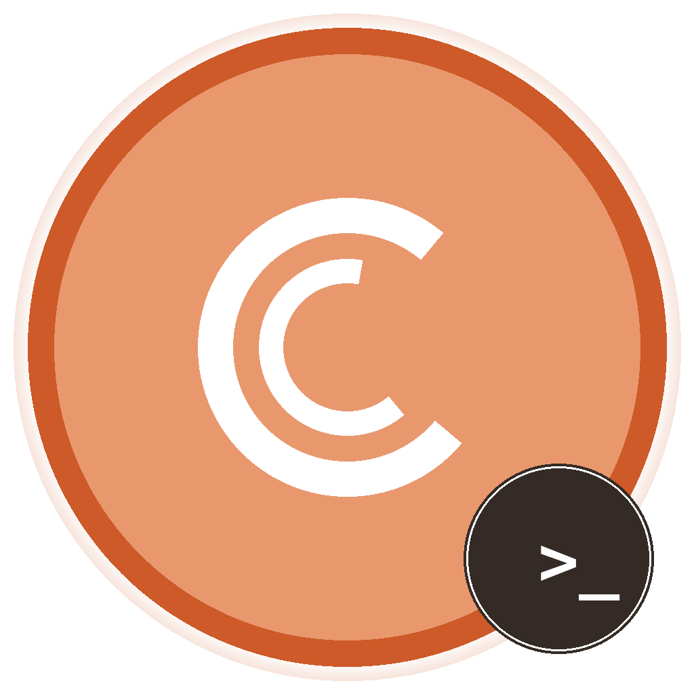

# Claude Manager

一个基于 Electron 的 Claude CLI 多会话管理工具，可以同时管理多个 Claude Code 会话，支持分屏、主题切换、自动审批等功能。



## 功能特性

- **多会话管理** — 同时运行多个 Claude CLI 会话，每个会话对应不同的项目目录
- **分屏模式** — 支持左右分屏同时查看两个会话
- **状态检测** — 实时检测会话状态（空闲/忙碌/等待确认/错误）
- **自动审批** — 可为单个会话或全局开启自动审批，自动处理 Claude CLI 的确认提示
- **主题切换** — 内置 14 种配色方案（Catppuccin、Dracula、Tokyo Night、Gruvbox 等）
- **历史项目** — 自动记录最近打开的项目，快速恢复会话
- **批量命令** — 向多个会话同时发送命令
- **拖拽支持** — 拖拽文件/文件夹到会话列表或终端区域
- **快捷键** — Cmd+N 新建、Cmd+W 关闭、Cmd+1-9 切换会话、Cmd+[/] 上下切换
- **字体缩放** — Cmd+/- 调整终端字体大小

## 安装

### 从源码构建

```bash
# 克隆仓库
git clone https://github.com/jabitop/claude-manager.git
cd claude-manager

# 安装依赖
npm install

# 开发模式运行
npm run electron:dev

# 构建生产版本（macOS DMG）
npm run build
npx electron-builder --mac --config electron-builder.json -c.mac.identity=null
```

构建产物在 `release/` 目录下。

### 安装到 Applications

```bash
rm -rf "/Applications/Claude Manager.app"
cp -R "release/mac-arm64/Claude Manager.app" "/Applications/Claude Manager.app"
```

> **注意：** 通过 DMG 覆盖安装可能不会完全替换旧文件，建议先删除再复制。

## 前置要求

- macOS (Apple Silicon)
- [Claude Code CLI](https://docs.anthropic.com/en/docs/claude-code) 已安装（`/opt/homebrew/bin/claude`）
- Node.js 18+

## 技术栈

- **Electron** — 桌面应用框架
- **React** — UI 框架
- **Vite** — 前端构建工具
- **xterm.js** (@xterm/xterm) — 终端模拟器
- **node-pty** — 伪终端
- **Zustand** — 状态管理

## 项目结构

```
├── electron/           # Electron 主进程代码
│   ├── main.ts         # 主进程入口、IPC 处理、Hook 服务器
│   ├── preload.ts      # 预加载脚本，暴露 API 给渲染进程
│   ├── session-manager.ts  # 会话管理（pty 创建/销毁/状态）
│   └── status-detector.ts  # 会话状态检测（忙碌/空闲/等待确认）
├── src/                # React 前端代码
│   ├── App.tsx         # 主界面布局
│   ├── App.css         # 全局样式
│   ├── themes.ts       # 主题配色方案
│   ├── components/
│   │   ├── Terminal.tsx    # xterm 终端组件
│   │   ├── Sidebar.tsx    # 侧边栏（会话列表/历史项目）
│   │   ├── SessionCard.tsx # 会话卡片
│   │   ├── StatusBar.tsx  # 底部状态栏
│   │   └── InputBar.tsx   # 输入栏
│   └── stores/
│       └── session-store.ts # Zustand 会话状态管理
├── assets/             # 应用图标
├── electron-builder.json  # 打包配置
└── vite.config.ts      # Vite 配置
```

## 开发

```bash
# 开发模式（带 TypeScript 编译）
npm run electron:dev

# 仅构建前端
npm run build

# 运行测试
npm test
```

## License

ISC
