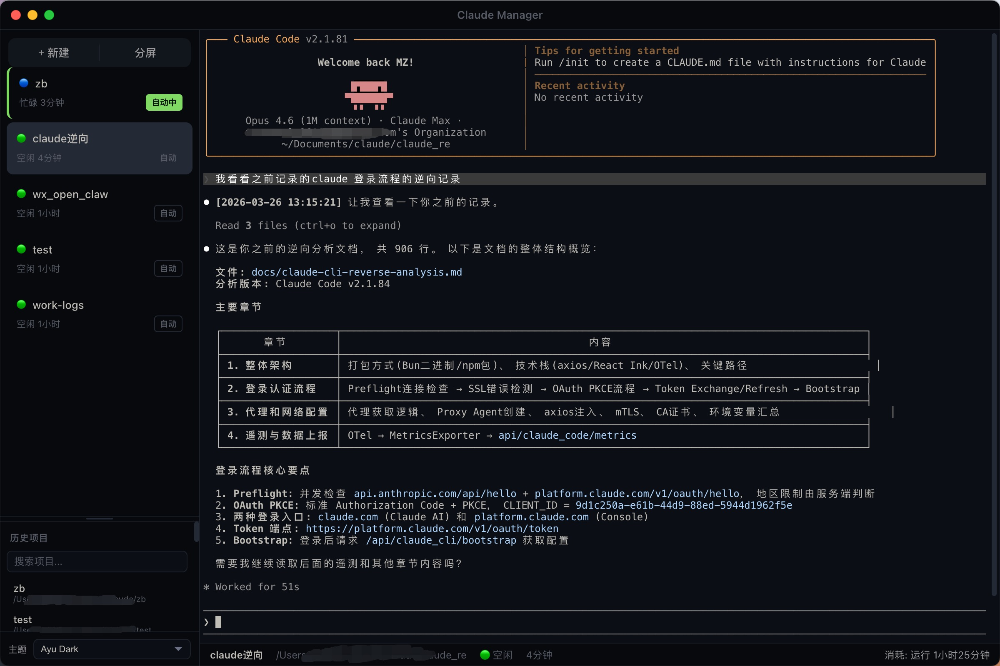

# Claude Manager

Claude Code 多会话管理器 — Electron 桌面端 + iOS 远程控制，支持终端复用、自动审批、语音输入。同时管理多个 Claude Code 会话，让 AI 编程真正实现多线程并行工作。



## 核心优势

### 多会话并行
同时运行多个 Claude 会话，每个会话独立工作在不同项目目录。一个会话在写前端，另一个在改后端，第三个在跑测试 — 全部并行，互不干扰。

### 智能自动模式
开启"自动"后，Claude 不再废话：
- **跳过废话确认** — Claude 问"你觉得行不行？""要我继续吗？"时自动回复"继续，按你的方案执行"，支持中英文问句识别
- **权限自动审批** — `[Y/n]`、权限请求等确认提示自动通过
- **零人工干预** — 让 Claude 持续工作，不用盯着屏幕点确认

### Rate Limit 自动恢复
Token 用完了？不用守着等。应用自动检测限流提示，解析重置时间，到时间自动发送 `/resume` 让 Claude 继续工作。离开电脑回来发现任务已经做完了。此功能对所有会话默认生效，无需手动开启。

### 拖拽排序
会话列表支持拖拽自定义排序，顺序跨重启持久保存。不再被自动排序打乱你的工作节奏。

### iOS / Web 远程控制
手机上也能管理会话。内置 Web 服务器，手机浏览器访问即可：
- **创建/打开/关闭会话** — 远程操作，和桌面端完全同步
- **实时终端输出** — WebSocket 推送，低延迟查看 Claude 工作进展
- **语音输入** — iOS 原生语音识别，说话代替打字给 Claude 下指令
- **自动审批控制** — 远程开关自动模式

## 功能特性

- **分屏模式** — 左右分屏同时查看两个会话
- **状态检测** — 通过 hooks 实时检测会话状态（空闲/忙碌/等待确认/错误）
- **14 种主题** — 内置 Ayu Dark、Catppuccin、Dracula、Tokyo Night 等配色方案
- **历史项目** — 自动记录最近打开的项目，快速恢复
- **批量命令** — 向多个会话同时发送命令
- **拖拽创建** — 拖拽文件夹到侧边栏直接创建会话
- **字体缩放** — `Cmd++`/`Cmd+-` 调整终端字体
- **外部链接** — 终端中的链接用系统默认浏览器打开
- **优雅退出** — 关闭应用时安全终止所有 PTY 进程
- **iOS 远程控制** — 手机浏览器远程管理会话，支持语音输入

## 平台支持

- **macOS** (Apple Silicon / Intel) — 完整支持
- Windows / Linux — 暂不支持

## 安装

### 前置要求

| 依赖 | 最低版本 | 验证方式 |
|------|---------|---------|
| Node.js | 18+ | `node --version` |
| Claude Code CLI | 最新 | `claude --version` |

```bash
# 安装 Claude Code CLI（如未安装）
npm install -g @anthropic-ai/claude-code
```

### 从源码构建

```bash
git clone https://github.com/Mxxq12/claude-manager.git
cd claude-manager
npm install

# 开发模式
npm start

# 构建生产版本
npm run build:all
```

### 安装到 Applications

```bash
rm -rf "/Applications/Claude Manager.app"
cp -R "release/mac-arm64/Claude Manager.app" /Applications/
```

## 远程访问（iOS / 手机浏览器）

应用启动后自动开启 Web 服务器，默认监听 `4000` 端口。

### 环境变量

| 变量 | 默认值 | 说明 |
|------|--------|------|
| `CLAUDE_REMOTE_PORT` | `4000` | Web 服务器端口 |
| `CLAUDE_REMOTE_PASSWORD` | `admin123` | 登录密码 |

### 局域网访问

同一 Wi-Fi 下，手机浏览器直接访问 `http://<Mac的IP>:4000` 即可。

### 公网访问（Cloudflare Tunnel）

出门在外想远程控制家里/办公室的电脑？用 Cloudflare 临时隧道（免账号、免配置）：

```bash
# 安装 cloudflared（只需一次）
brew install cloudflared

# 开通公网隧道
cloudflared tunnel --url http://localhost:4000
```

终端会输出一个 `https://xxx-xxx.trycloudflare.com` 地址，手机浏览器或 iOS App 填进去就能用。

> **注意：** 快速隧道每次重启域名都会变。需要固定域名请使用 [Cloudflare 账号的 named tunnel](https://developers.cloudflare.com/cloudflare-one/connections/connect-apps)。

其他可选方案：[ngrok](https://ngrok.com)、[frp](https://github.com/fatedier/frp)、[tailscale](https://tailscale.com) 等。

## 快捷键

| 快捷键 | 功能 |
|--------|------|
| `Cmd+N` | 新建会话 |
| `Cmd+W` | 关闭当前会话 |
| `Cmd+1` ~ `Cmd+9` | 切换到第 N 个会话 |
| `Cmd+[` / `Cmd+]` | 切换上/下一个会话 |
| `Cmd++` / `Cmd+-` | 调整终端字体大小 |
| `Cmd+0` | 重置字体大小 |

## 自动模式说明

每个会话卡片上有"自动"按钮，开启后：

1. **废话提问自动跳过** — 检测 Claude 输出中的提问模式（`？`、`要我`、`是否`、`should I`、`do you want` 等），自动回复继续执行
2. **权限确认自动通过** — 终端中的 `[Y/n]` 提示和 `PermissionRequest` hook 触发时自动审批
3. **交互菜单自动选择** — sandbox 权限弹窗自动选择"Yes"

> **注意：** Rate Limit 自动恢复功能不需要开启自动模式，对所有会话默认生效。

## 安全提示

本工具以 `--dangerously-skip-permissions` 模式启动所有 Claude 会话，Claude 将跳过权限确认直接执行操作。**请仅在信任的项目目录中使用。**

应用启动时会自动注入 hooks 到 `~/.claude/settings.json` 用于状态检测，仅通过本地 HTTP 服务器通信。

## 技术栈

Electron + React + Vite + xterm.js + node-pty + Zustand + Express + WebSocket + Swift (iOS)

## NPM Scripts

| 命令 | 说明 |
|------|------|
| `npm start` | 开发模式启动 |
| `npm run build` | 编译 TypeScript + 构建前端 |
| `npm run build:all` | 完整构建（编译 + 打包） |
| `npm run clean` | 清理所有构建产物 |
| `npm run typecheck` | TypeScript 类型检查 |
| `npm test` | 运行测试 |

## License

ISC
